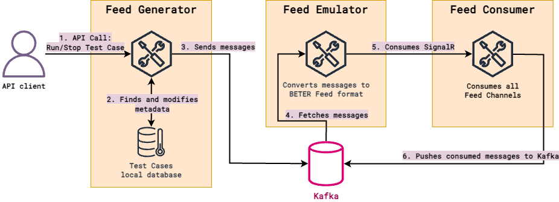

# BETER Feed Testing Sandbox (BFTS)

This repository contains a suite of services designed for testing BETER's Feed. The project consists of three main
services:

- **Feed Generator**: An application to launch the playback of prepared test scenarios.
- **Feed Emulator**: An application that emulates BETER's Feed, listens for Feed Consumer connections and delivers
test run's messages generated by the Feed Generator to all Feed Consumer connections.
- **Feed Consumer**: A simple implementation of BETER Feed Consumer, capable of connecting to the Feed and listening
for data. It is primarily utilized as a **testing client** for development purposes rather than for production usage.

The overall architecture for testing Feed integration by the Client presented on the picture.



**Feed Generator** application provides REST API to start and stop test case playback. It supports the following features:
1. You may run the same test case (identified by `caseId`) in parallel as many times as you wish.

## Prerequisites

For testing only:
- [Docker Engine](https://docs.docker.com/engine/install/);
- [Docker Compose](https://docs.docker.com/compose/install/).

For development (modification of tools or if you want to build and run tools yourself locally):
- [Docker Engine](https://docs.docker.com/engine/install/);
- [Docker Compose](https://docs.docker.com/compose/install/);
- [.NET SDK 7](https://dotnet.microsoft.com/en-us/download) or greater. 

## Run the applications

You have a few options to start the application:
* Run pre-built Docker images hosted on Docker Hub. The simplest option that launches all required application in 1
minute.
* Build Docker images from sources. This option may be a good option if according to your security policies you can't
run unaudited software locally or on production servers. You may audit this repository, build images and run them.
You may also publish locally built images to your own storage for images like Nexus, or to publicly available services
like Docker Hub or GitHub Packages.
* Launch dependencies in Docker containers locally and build all required applications locally too. Applications connect 
to local Docker containers and exchange the data. This option is the best for the development of the applications, for
example if you want to improve our tool and send us back pull request.

### Run pre-built Docker images

BETER maintain the following Docker images:
* [beterco/beter-feed-testing-sandbox-generator](https://hub.docker.com/r/beterco/beter-feed-testing-sandbox-generator)
- image of the Feed Generator application;
* * [beterco/beter-feed-testing-sandbox-emulator](https://hub.docker.com/r/beterco/beter-feed-testing-sandbox-emulator)
- image of the Feed Emulator application;

We prepared [`docker-compose.yml`](docker-compose.yml) for you to simplify the launch. By default, without any
additional configuration:
* Port `8080` is exposed on host machine with Kafka UI;
* Kafka ports are not exposed on host machine at all;
* Latest version (latest Docker tag) will be used for Feed Emulator and Feed Generator published on Docker Hub;
* Feed Generator exposes port `51857` on host machine;
* Feed Emulator exposes port `51858` on host machine;
* Feed Consumer is not launched.

To launch everything by default process with next steps.

1. Download
[`docker-compose.yml`](https://github.com/BETER-CO/beter-feed-testing-sandbox/blob/master/docker-compose.yml).

2. Launch it in background

```
$ docker-compose up -d
```

3. Check services are running

```
docker ps -a
CONTAINER ID   IMAGE                                                 COMMAND                   CREATED          STATUS                            PORTS                                              NAMES
11c7aedda99f   beterco/beter-feed-testing-sandbox-emulator:latest    "dotnet Beter.Feed.T…"    13 seconds ago   Up 3 seconds (health: starting)   0.0.0.0:51858->80/tcp                              bfts-emulator
6a06c23d0ea7   beterco/beter-feed-testing-sandbox-generator:latest   "dotnet Beter.Feed.T…"    13 seconds ago   Up 3 seconds (health: starting)   0.0.0.0:51857->80/tcp                              bfts-generator
766924df4e61   confluentinc/cp-kafka:7.4.1                           "/bin/sh -c '\n# bloc…"   13 seconds ago   Exited (0) 4 seconds ago                                                             bfts-init-kafka
cc842a46143d   provectuslabs/kafka-ui:latest                         "/bin/sh -c 'java --…"    13 seconds ago   Up 8 seconds                      0.0.0.0:8080->8080/tcp                             bfts-kafka-ui
c0810d48eda7   confluentinc/cp-kafka:7.4.1                           "/etc/confluent/dock…"    13 seconds ago   Up 13 seconds (healthy)           0.0.0.0:64430->9092/tcp, 0.0.0.0:64431->9101/tcp   bfts-kafka
```

> `bfts-init-kafka` container is in "exited" status. It's ok, this container launches once to create Kafka topics.

You may configure ports used and other options by setting environment variables before launch of the `docker-compose`:
* `BFTS_KAFKA_UI_PORT` - sets port used for Kafka UI.
* `BFTS_GENERATOR_PORT` - sets port used by Feed Generator to receive API commands to run/list/stop test scenarios.
* `BFTS_EMULATOR_PORT` - sets port used by Feed Emulator to connect by Feed Consumer and also control emulator via
REST API.
* `BFTS_GENERATOR_DOCKER_IMAGE_VERSION` - specify exact version of the Feed Generator published to Docker Hub (you
may put `latest` as well).
* `BFTS_EMULATOR_DOCKER_IMAGE_VERSION` - specify exact version of the Feed Emulator published to Docker Hub (you
may put `latest` as well).

You may prepend env variables to `docker-compose` command to activate mentioned settings
```
$ BFTS_KAFKA_UI_PORT=8011 \
  BFTS_GENERATOR_PORT=8012 \
  BFTS_EMULATOR_PORT=8013 \
  BFTS_GENERATOR_DOCKER_IMAGE_VERSION=1.0.1 \
  BFTS_EMULATOR_DOCKER_IMAGE_VERSION=1.0.1 \
  docker-compose up -d
```

Or you may put env variables in `.env` file and run `docker-compose` as usual.

```
$ cat .env
BFTS_KAFKA_UI_PORT=8011
BFTS_GENERATOR_PORT=8012
BFTS_EMULATOR_PORT=8013
BFTS_GENERATOR_DOCKER_IMAGE_VERSION=1.0.1
BFTS_EMULATOR_DOCKER_IMAGE_VERSION=1.0.1

$ docker-compose up -d
```

### Build Docker images from sources.

TBD

### Other (temporary)

Check

To start the feed services, follow these steps:
1. **Clone the Repository:**
    ```sh
    git clone https://github.com/BETER-CO/beter-feed-testing-sandbox.git
    cd beter-feed-testing-sandbox
    ```

2. **Docker Configuration:**
    Make sure you have two Docker Compose files in the root directory:
    - `docker-compose.development.yaml`
    - `docker-compose.development.override.yaml`

3. **Start the Docker Services:**
    Run the following command:

    ```sh
    docker-compose -f docker-compose.development.yml -f docker-compose.development.override.yml up --build
    ```

    This command builds the Docker images and starts the services defined in the `docker-compose.development.yaml` and `docker-compose.development.override.yaml` files. Each of the feed services (Generator, Emulator) is built from local Dockerfiles and runs on specific ports. They all depend on Kafka and Kafka-UI dependencies.

Upon running `docker-compose`, the following containers will be created:

- **kafka**: Runs Confluent's Kafka server, exposing ports 9092 and 9101 for communication.
- **init-kafka**: A service used for initializing Kafka topics required by the application.
- **kafka-ui**: Provides a user interface for managing Kafka topics, accessible via port 8080.
- **generator**: Hosts the Feed Generator service, running on port 51857.
- **emulator**: Hosts the Feed Emulator service, running on port 51858.

These containers are interconnected and rely on each other, with dependencies managed through Docker Compose.

## Documentation
For comprehensive documentation covering all aspects of the Beter Feed Testing Sandbox, including usage guidelines and API description visit [https://docs.beter.co/public/beter-feed-testing-sandbox/general](https://docs.beter.co/public/beter-feed-testing-sandbox/general). There you will find detailed documentation to help you make the most of the testing sandbox. 

## Contributing
Contributions are welcome! If you encounter any issues or have suggestions for improvement, feel free to open an issue or submit a pull request in the repository.
