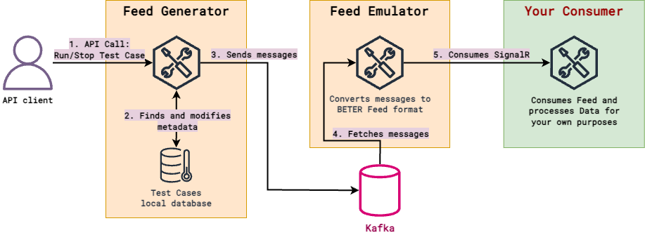
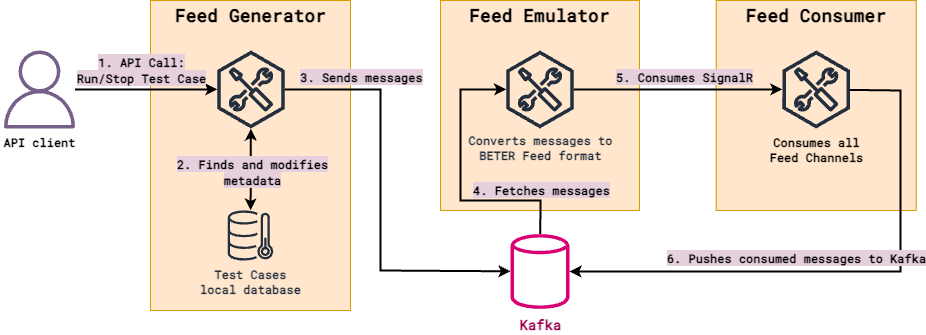

# BETER Feed Testing Sandbox (BFTS)

This repository contains a suite of services designed for testing BETER's Feed. The project consists of three main
services:

- **Feed Generator**: An application that launches the playback of prepared test scenarios.
- **Feed Emulator**: An application that emulates BETER's Feed. It listens for Feed Consumer connections and delivers
test run messages generated by the Feed Generator to all Feed Consumer connections.
- **Feed Consumer**: A simple implementation of a BETER Feed consumer, capable of connecting to the Feed and listening
for data. It is primarily utilized as a **testing client** for development purposes rather than for production usage.

The overall architecture for testing Feed integration by the Client presented on the following diagram.

You can also use the Feed Consumer application to investigate Feed data contracts and the raw data delivered through
the Feed Emulator. The Feed Consumer from this repository stores consumed data in Kafka, and with the help of Kafka UI,
you can explore and analyze this data. In this mode, the scheme looks like this:

## Documentation

- [Building and Running Applications](doc/RUNNING_APPS.md)
- [Running Test Consumer](doc/TEST_CONSUMER.md) (optional)
- [BFTS Assumptions](doc/ASSUMPTIONS.md)
- [Feed Generator and Feed Emulator API](doc/API.md)
- [Test Cases](doc/SCENARIOS.md)

## Contributing

We welcome contributions! If you encounter any issues or have suggestions for improvements, please open an issue or submit a pull request in the repository. For detailed guidelines on how to contribute, please refer to our [Contributing Guide](CONTRIBUTING.md).

