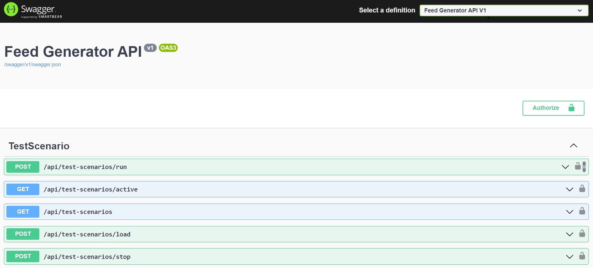
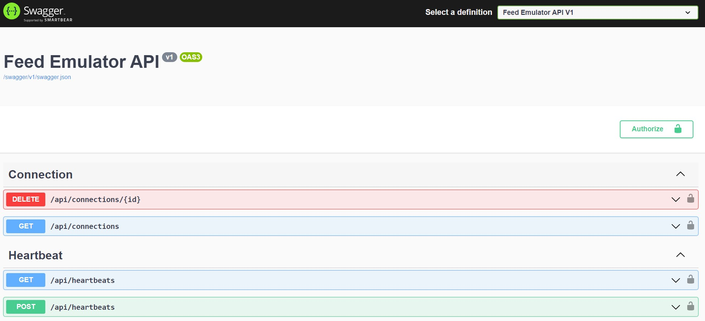
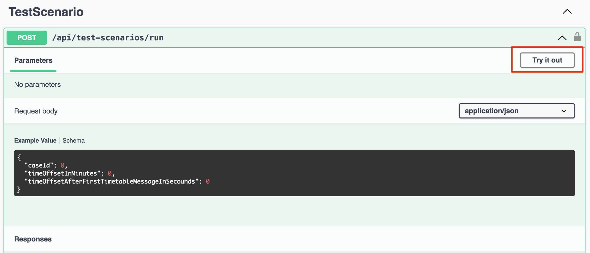
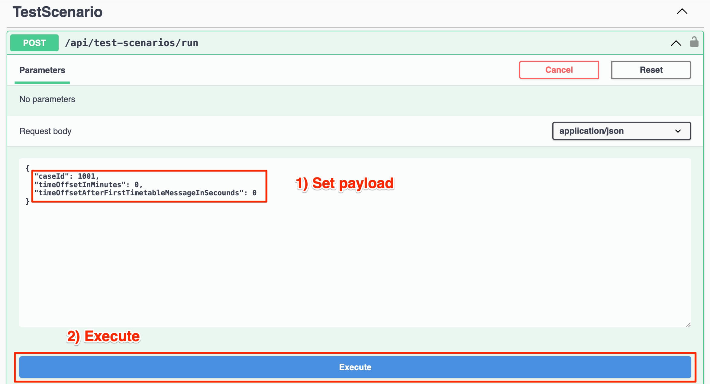
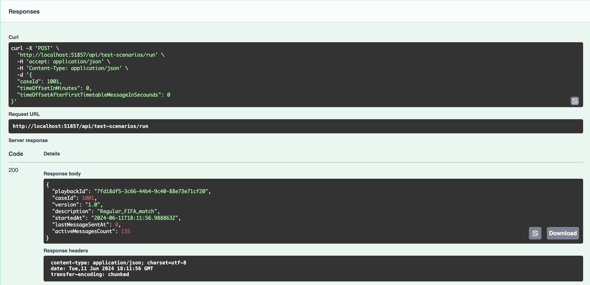

# API docs

This section describes the API for managing the Feed Generator and Feed Emulator.
This is part of the testing application responsible for replaying sandbox test cases.

You may use Swagger for managing:
* Feed Generator: http://localhost:51857/swagger/index.html
* Feed Emulator: http://localhost:51858/swagger/index.html

> Change ports if you [launched applications](RUNNING_APPS.md) exposing different ports.

## Using Swagger

1. Visit Swagger pages and find the appropriate API method.

**Feed Generator Swagger API screenshot**:



**Feed Emulator Swagger API screenshot**:



2. You may find examples of calls and possible responses with status codes. If you click "Try it out" you may
make an API call right from Swagger.



3. Change the payload and click "Execute".



4. You will see response data.



## Using REST API programmatically

### Feed Emulator

#### Manage Connections

Using the methods for managing connections,
you can delete connections by `connectionID` and get a list of currently active connections to the Feed Emulator.

<details>
<summary>Drop the connection - DELETE /api/connections/{id}</summary>

Method: ```DELETE /api/connections/{id}```

The method disconnect the FeedConsumer using connectionID. Drop connection shouldn`t affect on the data replay

**Parameters**
| Parameter | Type    | Description                               |
| ----------| ------- | ----------------------------------------- |
| id        | string  | The connection ID which should be dropped |

**Response**

STATUS 200 - Connection is successfully deleted

</details>

<details>
<summary>Get all active connections - GET /api/connections</summary>

Method: ```GET /api/connections```

The method returns the list of active connections.

**Parameters**
No parameters

**Response**

STATUS 200 - *application/json* Returned list of active connections.

```
[
    {
        "id": "string",
        "feedChannel": "string",
        "date": "2024-05-19T16:28:29.005Z",
        "ipAddress": "string"
    }
]
```
</details>

### Manage Heartbeats

This section describes the methods for managing heartbeat. Using these methods, you can get the current status of the heartbeat,
as well as stop or resume the sending of the heartbeat. Stopping the sending of the heartbeat does not affect data transmission.
If the sandbox scenario is running, it will continue to send messages to the channels.

<details>
<summary>Get heartbeat state - GET /api/heartbeats</summary>

Method: ```GET /api/heartbeats```

The method returns the state of heartbeats, where `1` means run and `2` means stopped

**Parameters**
No parameters

**Response**

STATUS 200 - *application/json* Returned state of heartbeats.
```
{
    "id": 1,
    "name": "Run"
}
```
</details>

<details>
<summary>Start/Stop heartbeats - POST /api/heartbeats</summary>

Method: ```POST /api/heartbeats```

You can manage the heartbeats using this method. You are able to stop and resume heartbeats.

**Request**
```
{
    "command": 0
}
```
Possible commands:
* 1 - Run heartbeat
* 2 - Stop heartbeat

**Response**

STATUS 200 - *application/json* The command successfully executed. Returns the new state of heartbeats.

```
{
  "id": 1,
  "name": "Run"
}
```

STATUS 400 - Incorrect request or incorrect values.
</details>

### Feed Generator

#### Manage Sandbox Scenarios

This section describes the methods for managing the playback of sandbox scenarios.
The built-in sandbox scenarios will automatically load when the application starts.

* Using the `GET /api/test-scenarios` method, you can get a list of the loaded sandbox cases.
  You can also use `caseId` from the [Sandbox Scenarios](SCENARIOS.md) documentation.
* To run a specific sandbox scenario, use the `POST /api/test-scenarios/run` method. You can also set additional delays.
  Using the `GET /api/test-scenarios/active` method, you can get a list of currently running sandbox scenarios.
* If you need to stop the playback of sandbox scenarios, you can do so using the `POST /api/test-scenarios/stop` method.
  You can stop a specific sandbox scenario or stop all scenarios at once.
* If you want to use your own sandbox scenario, you need to upload it as a file using the `POST /api/test-scenarios/load` method.
  Note that you will need to upload the file again each time the application starts.
  Also, you need to upload the file in the correct format. We recommend using the existing sandbox scenario structure.

> Please take into account that the Testing Sandbox is not a full-fledged BETER Feed, 
> and the playback of custom sandbox scenarios may not occur exactly as expected. 
> If you need additional sandbox scenarios, please write to the support chat, and we will add them in the next update.


<details>
<summary>Run the sandbox scenario - POST /api/test-scenarios/run</summary>

Method: ```POST /api/test-scenarios/run```

You should use this method to run the sandbox scenario. Also you may setup the extra delays.

**Request**
```
{
    "caseId": 0,
    "timeOffsetInMinutes": 0,
    "timeOffsetAfterFirstTimetableMessageInSecounds": 0
}
```
| Parameter                                      | Type | Description                                                                 |
| ---------------------------------------------- | ---- | --------------------------------------------------------------------------- |
| caseId                                         | Int  | The case Id. You can get it from the documentation.                         |
| timeOffsetInMinutes                            | Int  | This parameters define the extra delay between the time when sandbox scenario is run and first message recieved. |
| timeOffsetAfterFirstTimetableMessageInSecounds | Int  | This parameters define the extra delay between the first message from the `time_table` and the next one. You may use this time delay if you need some actions to prepare your system. |

**Response**

STATUS 200 - *application/json* The sandbox scenario is successfully run. The method returns the info about run scenario.
```
{
    "playbackId": "fa1b7467-43e9-4931-bd6c-83775c5f4662",
    "caseId": 1001,
    "version": "1.0",
    "description": "Regular_FIFA_match",
    "startedAt": "2024-05-20T09:04:52.0565355Z",
    "lastMessageSentAt": 0,
    "activeMessagesCount": 134
}
```
STATUS 400 - Incorrect request or incorrect values.

STATUS 404 - The sandbox scenario is not found.
</details>

<details>
<summary>Get active scenario - GET /api/test-scenarios/active</summary>

Method: ```GET /api/test-scenarios/active```

This method returns the list of active sandbox scenarios. 

**Request**
No parameters

**Response**

STATUS 200 - *application/json* Returns the list of active scenarios.
```
[
    {
        "playbackId": "93598821-6542-453a-a7ee-f731636dc411",
        "caseId": 1001,
        "version": "1.0",
        "description": "Regular_FIFA_match",
        "startedAt": "2024-05-20T11:59:50.3638127Z",
        "lastMessageSentAt": 1716206389277,
        "activeMessagesCount": 132
    }
]
```
</details>


<details>
<summary>Get the list of all scenarios - GET /api/test-scenarios</summary>

Method: ```GET /api/test-scenarios```

This method returns the list of all sandbox scenarios. 

**Request**
No parameters

**Response**

STATUS 200 - *application/json* Returns the list of available sandbox scenarios.
```
[
    {
        "caseId": 0,
        "version": "string",
        "description": "string"
    }
]
```
</details>


<details>
<summary>Upload custom scenario - POST /api/test-scenarios/load</summary>

Method: ```POST /api/test-scenarios/load```

You can upload the custom sandbox scenario using this method. 
You should prepare the JSON file in a valid structure format (or you can correct exist one).
Uploaded sandbox scenarios store in memory only while the application is running. 
If you restart, you will need to upload them again.

**Request**
| Parameter       | Type  | Description                                                                  |
| --------------- | ----- | ---------------------------------------------------------------------------- |
| file            | JSON  | File with a sandbox scenario. File name should be integer it defines the `caseId` (example file name: "254.json"). |

**Response**

STATUS 200 - *application/json* The sandbox scenario is loaded successfully.
```
{
  "caseId": 347,
  "version": "1.0",
  "description": "Regular_FIFA_match"
}
```
STATUS 400 - Invalid file name or file structure
</details>

<details>
<summary>Stop the replay of sandbox scenarios - POST /api/test-scenarios/stop</summary>

Method: ```POST /api/test-scenarios/stop```

The method interrupt the replaying of certaine sandbox scenario. 

**Request**
```
{
    "playbackId": "string",
    "command": 1
}
```

| Parameter           | Type    | Description                               |
| ------------------- | ------- | ----------------------------------------- |
| playbackId          | string  | The id of certine playback. You may get it from active sandbox scenarios `GET /api/test-scenarios/active` |
| command             | Integer | "1" - stop the specific sandbox case (need to specify `playbackId`), "2" - stop all sandbox cases (`playbackId` can be empty). |

**Response**

STATUS 200 - Connection is successfully deleted
```
{
    "command": 1,
    "items": [
        {
            "playbackId": "7be9b75d-bf10-4c1c-9797-bdd40767f3a1",
            "testCaseId": 1001,
            "version": "1.0",
            "description": "Regular_FIFA_match"
        }
    ]
}
```
STATUS 400 - Incorrect request or incorrect values.

STATUS 404 - The sandbox scenario is not found.
</details>
