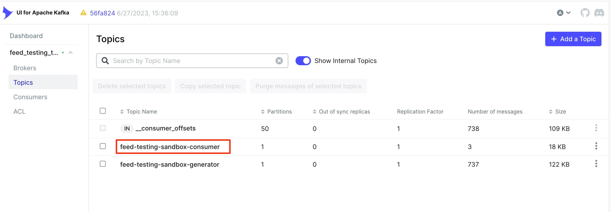
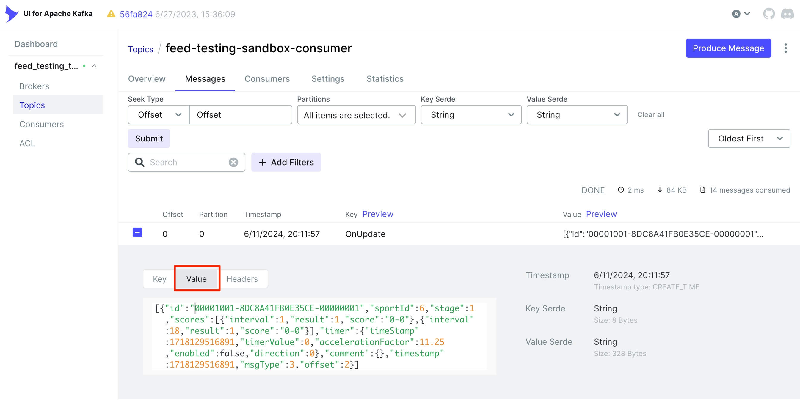
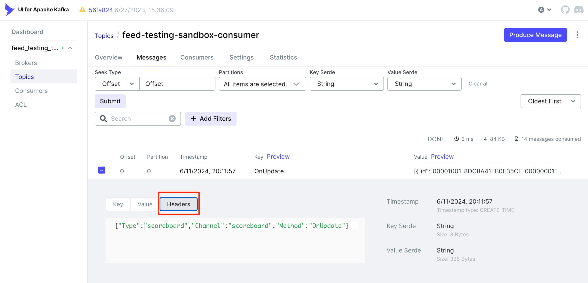
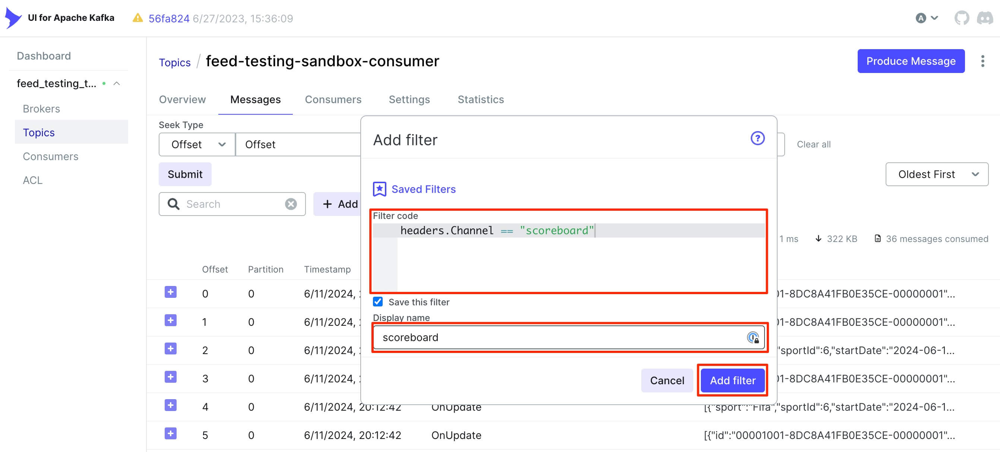
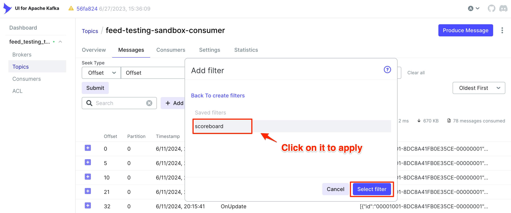

# Running Testing Feed Consumer

## Prerequisites

The following applications must be launched:
* Kafka and Kafka UI (in [local development mode](RUNNING_APPS.md#local-development));
* Feed Generator;
* Feed Emulator.

The Feed Consumer from this repository connects to the Feed Emulator, consumes messages via SignalR, and stores them
in Kafka for further analysis or comparison. You may launch your own Kafka instance, or use Kafka from
[`docker-compose.development.yml`](../docker-compose.development.yml).

> Feed Consumer writes to Kafka, so Kafka's port must be exposed to the host machine if you run Feed Consumer on
> host machine.

You will likely implement your own consumer with specific business logic, so feel free to use your own consumer
for testing integration. This Feed Consumer is suitable for Feed Generator and Feed Emulator development and data
discovery.

## Build testing Feed Consumer

Steps:

1. Clone the repository, or skip this step if the repository has already been cloned.

```shell
$ git clone https://github.com/BETER-CO/beter-feed-testing-sandbox.git
$ cd beter-feed-testing-sandbox
```

2. Choose the appropriate version of BFTS.

```shell
$ git tag
v1.0.0
v1.0.1

$ git checkout tags/v1.0.1
```

3. Build the Feed Consumer

```shell
$ dotnet build src/Hosts/Beter.Feed.TestingSandbox.Consumer/Beter.Feed.TestingSandbox.Consumer.csproj
```

4. Launch the Feed Consumer

By default, Feed Consumer tries to connect to the Kafka broker on `localhost:9092`. If you run Kafka on a different
port:
* change `Publisher.BootstrapServers` in `src/Hosts/Beter.Feed.TestingSandbox.Consumer/configs/appsettings.json` and
rebuild the Feed Consumer as shown above;
* alternatively, set the environment variable `Publisher__BootstrapServers` (preferred option).

Specify the host and port on which Feed Emulator listens for connections:
* change `FeedService.Host` in `src/Hosts/Beter.Feed.TestingSandbox.Consumer/configs/appsettings.json` and 
rebuild the Feed Consumer as shown above;
* alternatively, set the environment variable `FeedService__Host` (preferred option).

Example,

```shell
$ Publisher__BootstrapServers="localhost:8014" \
  FeedService__Host="http://localhost:51858" \
  dotnet src/Hosts/Beter.Feed.TestingSandbox.Consumer/bin/Debug/net7.0/Beter.Feed.TestingSandbox.Consumer.dll
```

5. Launch the test case after starting the Feed Emulator

> For more details, read [API document](API.md).

## Kafka UI basics

Messages consumed by Feed Consumer are stored in Kafka topic `feed-testing-sandbox-consumer`.

> Topic can be redefined with the environment variable `FeedService__DestinationTopicName=your-topic-name`.




Go to "Messages" tab in Kafka UI to see all messages consumed and stored by the Feed Consumer.

The "Value" subtab of a specific message shows the content delivered via the Feed Emulator.



The next subtab "Headers" contains information about the channel of the Feed where the message appeared.



You can also set filters.



And save the filter for future reuse.



